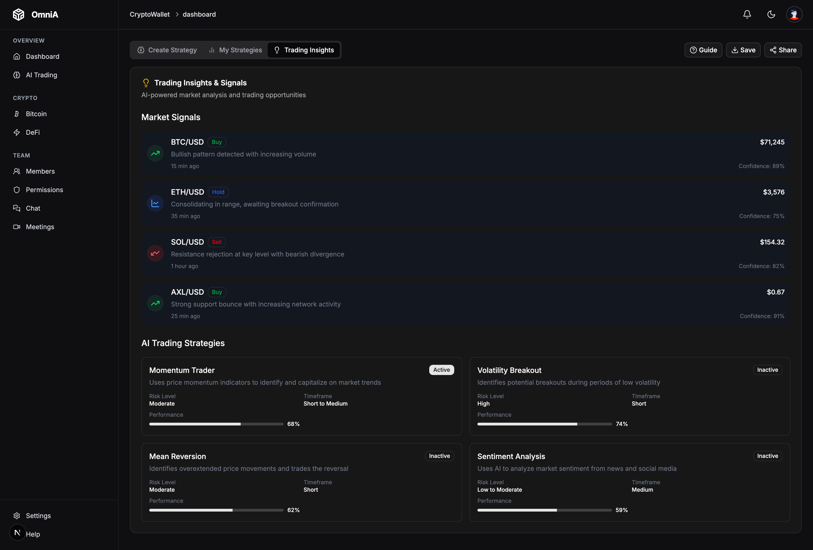
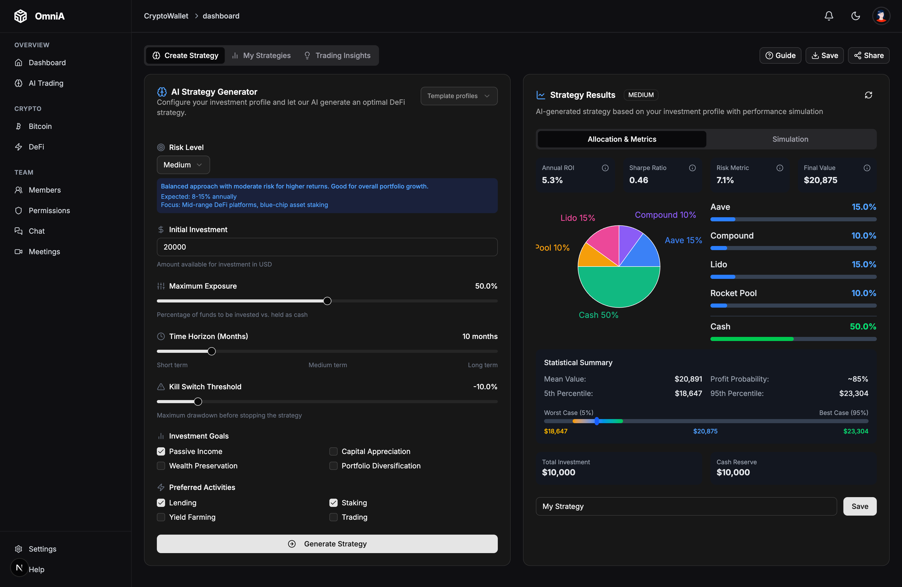
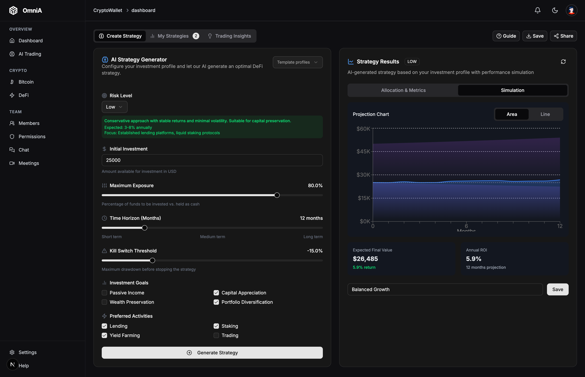

<p align="center">
<br />
    
<br />
</p>
<p align="center"><strong style="font-size: 24px;">AI-Powered DeFi Strategy Generator</strong></p>

<p align="center" style="display: flex; justify-content: center; align-items: center;">
    <span style="display: inline-flex; align-items: center; background-color: #1c1c1c; padding: 5px; border-radius: 6px;">
        
        <span style="margin: 0 10px; color: white; font-size: 14px;"></span>
        <a href="https://www.easya.io/">
            
        </a>
    </span>
</p>

---

### What is Omni AI?
Omni AI is a decentralized application that combines secure wallet management for Polkadot-based assets with an AI-powered investment strategy generator. Using Google's Gemini 2.5 Pro, it analyzes user preferences and market conditions to create personalized DeFi protocol allocations, while providing risk assessments and performance projections through Monte Carlo simulations. The platform empowers users to make informed investment decisions within the Polkadot ecosystem.


### Demo

Check out our video walkthrough:
[](https://www.loom.com/share/331aaac6fbea4b37b70c2bd4caffa899)
- [Demo v1 ]([https://www.youtube.com/watch?v=1BiVWuq7SzI](https://www.loom.com/share/331aaac6fbea4b37b70c2bd4caffa899))(25 Jun 2023)

### Technical Stack

#### Smart‑Contract Tooling
- Hardhat (v2.23.0) to compile, test and deploy Solidity contracts (e.g. swap.sol → SimpleDexMVP) against EVM‑compatible Substrate testnets.
- Contract artifacts (ABI, binary) checked into contracts/artifacts for on‑chain interactions.

#### Polkadot/Substrate Integration
- @polkadot/api (v15.9.2) as a WebSocket/JSON‑RPC client to any Substrate‑based node or parachain.
- @polkadot/extension‑dapp + @polkadot/extension‑inject for browser wallet injection (account selection, transaction signing).
- @polkadot/keyring for local sr25519/ed25519 keypair management, and @polkadot/util + @polkadot/util‑crypto for hashing, key derivation, SS‑58 encoding, etc.
- @polkadot/types to deserialize on‑chain data into strongly‑typed objects (balances, staking, contract calls).
- @polkadot/api‑contract to instantiate and call deployed contracts using their ABI—bridging EVM logic into your Substrate runtime.

#### What Polkadot Makes Uniquely Possible
- A unified "multi‑chain" UX: you can talk to any parachain (or a relay‑chain node) with one API client.
- Cross‑chain messaging (XCMP) under the hood means you can, in principle, move assets or relay signals between your wallet and other parachains without leaving the interface.
- On‑chain WASM runtime and upgradable modules let you combine EVM‑style DEX logic (via an EVM pallet like Moonbeam) with native Substrate pallets (staking, governance, oracles).
- Browser‑injected signing + API client + type safety gives you a rock‑solid end‑to‑end flow: fetch chain state, preview a strategy, simulate results, then sign & submit a real transaction.

Together, these pieces deliver a truly end‑to‑end "crypto wallet + AI‑powered trading strategy" experience, all built on Polkadot's extensible, multi‑chain architecture.

### Features

- **AI-Powered Strategy Generation:** Utilizes Google's Gemini 2.5 Pro model to create personalized protocol allocations
- **Risk-Adjusted Portfolios:** Customizes strategies based on risk tolerance, time horizon, and investment goals
- **Monte Carlo Simulations:** Projects 1000+ possible investment outcomes using advanced statistical methods
- **Interactive Data Visualization:** Presents allocation breakdowns and projections through dynamic charts
- **Performance Metrics:** Calculates key indicators including expected return, Sharpe ratio, and drawdown statistics
- **Strategy Comparison:** Saves and compares multiple investment strategies to identify optimal approaches
- **Real-Time Market Integration:** Incorporates live data from DefiLlama's API for up-to-date protocol metrics
- **Kill-Switch Functionality:** Implements automated stop-loss behavior to protect investments in adverse conditions


### Screenshots




### Roadmap

- [x] Develop core AI strategy generation engine
- [x] Implement Monte Carlo simulation for investment projections
- [x] Create interactive data visualization components
- [x] Integrate real-time market data from DeFi protocols
- [x] Build strategy comparison and saving functionality
- [ ] Add cross-chain portfolio optimization
- [x] Develop mobile-responsive interface
- [ ] Create API for third-party integrations
- [ ] Enhance AI model with reinforcement learning from user feedback
- [ ] Implement automated rebalancing suggestions


### Getting Started

First, run the development server:

```bash
npm run dev
# or
yarn dev
# or
pnpm dev
# or
bun dev
```

Open [http://localhost:3000](http://localhost:3000) with your browser to see the result.

You can start editing the page by modifying `app/page.tsx`. The page auto-updates as you edit the file.

This project uses [`next/font`](https://nextjs.org/docs/app/building-your-application/optimizing/fonts) to automatically optimize and load [Geist](https://vercel.com/font), a new font family for Vercel.

## Contributing & License

Help us build EasyAxPolkadot2025! This is an open-source software licensed under the [MIT License](https://opensource.org/licenses/MIT).
